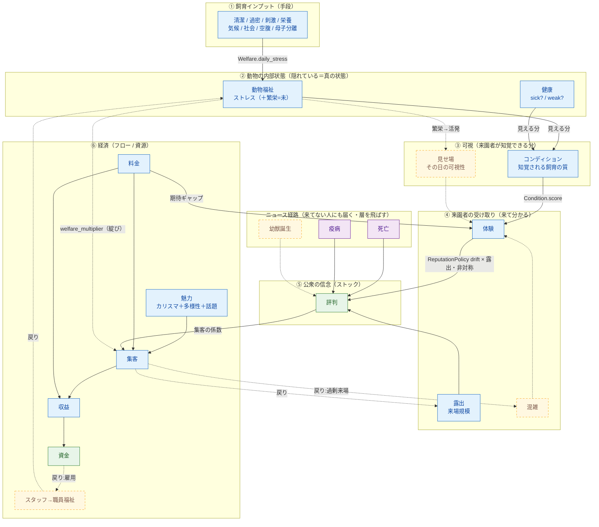

# 経済ドメイン関連図(集客・評判・福祉)

ここまでの設計議論で確定した**変数(ノード)**と**関数=ドメインサービス(辺)**の関連図。
凡例: 🟦実装済 / 🟨未実装(pending) / 🟥綻び(要修正) / 🟪イベント / 🟩ストック
線: 実線=順方向の因果 / 破線=フィードバックの戻り・未実装 / ニュースは層を飛ばす近道。

因果の背骨は6層になる:
`① 飼育インプット → ② 動物の内部状態(隠れ) → ③ 可視 → ④ 来園者の受け取り → ⑤ 信念(評判) → ⑥ 経済`。
完全な一方向ではなく、**経済→資源→福祉 / 集客→露出 の戻り**と、**死亡・疫病→評判 の近道**が層をまたぐ。

## 関連図

## 変数(ノード)早見表

| 変数 | 意味 | 種別 | 状態 |
|---|---|---|---|
| 飼育インプット | 清潔/過密/刺激/栄養/気候/社会/空腹/母子分離。福祉の**手段** | フロー入力 | 実装済 |
| 動物福祉 | 動物の心理状態(現状ストレス=ネガ側のみ) | 隠れた状態 | 実装済 |
| ポジティブ福祉(繁栄) | 中立超え。活発・遊ぶ → 見せ場へ | 隠れた状態 | 未実装 |
| 健康 | sick? / weak? | 隠れた状態 | 実装済 |
| コンディション | 来園者が**知覚する**飼育の質(見える福祉+健康) | 可視フィルタ | 実装済 |
| 見せ場 | その日その個体が出て活発か(可視性) | 可視フィルタ | 未実装 |
| 体験 | 来た人が感じた質 = g(コンディション, 料金, 〔混雑/見せ場〕) | 来園者の状態 | 実装済(一部) |
| 露出 | 来場規模。体験が口コミとして評判に伝わる強さ | 係数 | 実装済 |
| 混雑 | 来園者収容力に対する過剰来場。体験を下げる自己抑制 | 係数 | 未実装 |
| 評判 | 公衆の信用(ストック)。体験へ非対称ドリフト+イベント | ストック | 実装済 |
| 魅力 | カリスマ+多様性+話題(buzz)。来園前に知れる引き | 係数 | 実装済 |
| 料金 | 入園料。集客レバー兼、体験の期待を作る | レバー | 実装済 |
| 集客 | その日の来場者数 = f(魅力, 評判, 料金) | フロー | 実装済 |
| 収益/資金 | 集客×料金、運営費差引 | ストック | 実装済 |
| イベント | 死亡/疫病(ニュース経路, 露出非依存)、幼獣誕生 | ショック | 死亡/疫病=実装済 |
| 職員福祉 | スタッフの士気。資金↔ケア↔評判ループの環 | 隠れた状態 | 未実装 |

## 関数(ドメインサービス)早見表

| 関数 | 入力 | 出力 | 状態 |
|---|---|---|---|
| `Husbandry::Welfare.daily_stress` | animal, enclosure, season | その日のストレス増減 | 実装済 |
| `Husbandry::Condition.score` | animals | コンディション 0..100 | 実装済 |
| `Operations::VisitorExperience.score` | condition, fee | 体験 0..100 | 実装済(混雑/見せ場は未) |
| `Operations::ReputationPolicy.after_day` | reputation, experience, exposure, deaths, outbreak | 新しい評判 | 実装済 |
| `Operations::VisitorAttraction.expected_visitors` | animals, reputation, fee, buzz | 集客 | 実装済(welfare_multiplier 綻び) |

## 確定している原理

1. **隠れた状態は公衆の行動を直接動かさない。** 動物福祉は、可視フィルタ(コンディション/見せ場)か事件化(死亡/発病)を経てからでないと、集客にも評判にも効かない。
2. **時間の litmus。** 来園前に知れる→魅力(今日の集客)。来てみないと分かる→体験(口コミ→評判→翌日の集客)。
3. **評判の動学。** `評判' = 評判 + 露出 × ドリフト(体験 − 評判) + イベント`。ドリフトは非対称(築くは遅く、失うは速い)。
4. **チェーンの各段は「一つ上」への直接辺を持たない。** 清潔/過密 → 福祉 → コンディション → 体験 → 評判 と一段ずつ。

## 未解決(次に決める)

- 🟥 集客の `welfare_multiplier`(福祉→集客の直接辺)を削除し、福祉の効き口を評判一本に揃えるか。
- 🟨 動物福祉にポジティブ側(繁栄)を入れ、見せ場→体験 の上半分を開くか。
- 🟨 死因(帰責性)で死亡ペナルティを重みづけ。
- 🟨 職員福祉を主体として追加し、資金↔ケア↔評判ループを閉じるか。
- 🟨 評判の2軸化(観客評判/保全評判)。
